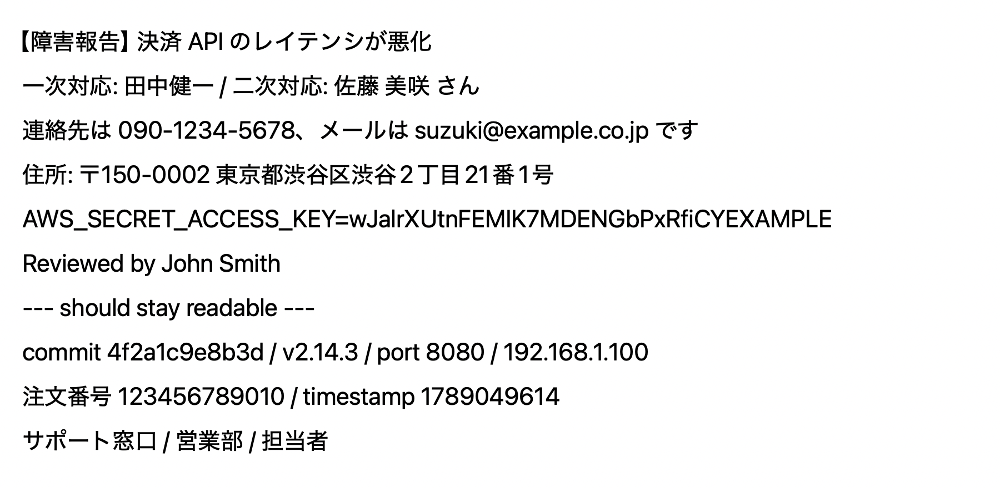
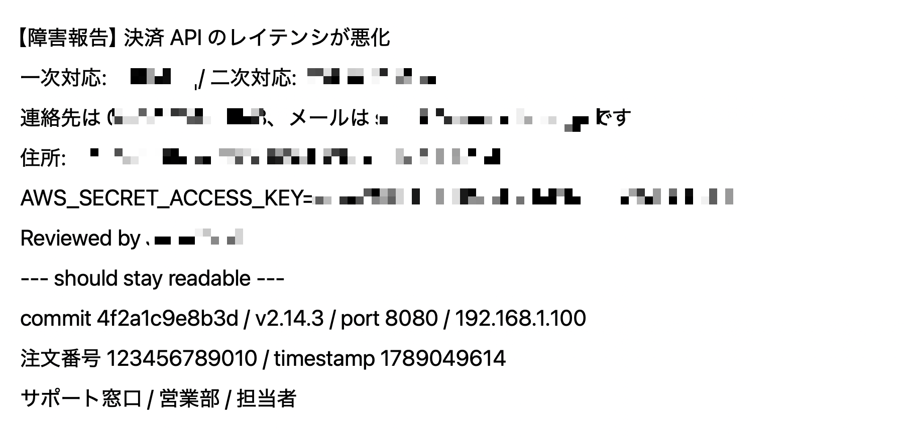

<p align="center">
  
</p>

<h1 align="center">Bokashi</h1>

<p align="center">A privacy-aware screenshot tool for macOS.</p>

> **Bokashi** (ぼかし) is the Japanese word for *blur* or *obscure*.
> Not to be confused with the composting method of the same name 🌱.

**Status:** v0.3.0 — adds on-device sensitive-info detection (one-click and click-to-mask) on top of the v0.2.0 mosaic flow.

## Sensitive-info detection

One click on **Detect** (or the auto-mask toggle) finds and masks personal
information in a screenshot, entirely on device. Japanese text is a first-class
target: names, phone numbers and addresses written the way Japanese documents
actually write them.

| Before | After |
|---|---|
|  |  |

Names, the phone number, the email, the postal code and address, the AWS secret
(the key name stays readable) and `John Smith` are masked. The commit hash,
version, port, IP address, order number, timestamp and role words below the
divider are left alone — masking those would ruin the screenshot.

Text detection is powered by [privmask](https://github.com/snaka/privmask):
`NSDataDetector` and patterns for the deterministic kinds, and Apple
Intelligence for Japanese personal names on eligible Macs. With the privmask
CLI installed (`brew install snaka/tap/privmask`), Bokashi also uses its
Japanese name model, so names are found without Apple Intelligence too.

## Why another screenshot tool?

Existing OSS macOS screenshot tools either feel dated, are non-native (Electron / Qt), or lack thoughtful annotation and privacy features. Bokashi aims to be:

- **Native macOS** — Swift, SwiftUI / AppKit, ScreenCaptureKit. No Electron.
- **Annotation-first** — arrows, boxes, ellipses, lines, undo/redo. Designed to feel right.
- **Privacy-aware** — captures stay in memory; closing the editor copies them to your clipboard. Bokashi never writes a screenshot to disk unless you explicitly ask, except for images sent in via the Share menu, which wait in an App Group container until Bokashi next launches and imports them. Manual mosaic masking now, and automatic detection of sensitive information (with Japanese-language support) on the roadmap.
- **Open source** — MIT licensed. Hackable, contribution-friendly.

## Features

| Feature | Status |
|---|---|
| Menubar app + global hotkeys | ✅ |
| Share menu integration | ✅ |
| Full-screen / window / region capture | ✅ |
| Editor with clipboard-first save flow | ✅ |
| Annotation tools (arrow / box / ellipse / line) | ✅ |
| Color & stroke-width pickers, undo / redo | ✅ |
| Manual mosaic masking | ✅ |
| On-device sensitive-info detection (email / phone / postal code / address / name / My Number / API keys and secrets, plus faces/avatars; Japanese names via Apple Intelligence on eligible Macs) | ✅ |
| Click-to-mask any OCR'd text region | ✅ |
| Auto-mask sensitive info (menubar toggle) | ✅ |
| Developer ID signed + notarized releases | ✅ |
| Homebrew Cask install (`snaka/tap/bokashi`) | ✅ |
| Auto-update via Sparkle | Planned (later) |

> **Enabling the Share menu entry.** macOS does not turn third-party
> share extensions on automatically. After installing Bokashi, tick it
> once under System Settings → General → Login Items & Extensions →
> Sharing. It then appears in the Share menu of any app that shares
> images.

See [docs/ROADMAP.md](docs/ROADMAP.md) for the full plan and
[CHANGELOG.md](CHANGELOG.md) for release history.

## Install

### Homebrew (recommended)

```sh
brew install --cask snaka/tap/bokashi
```

This pulls the latest signed and notarized `.dmg` from
[Releases](https://github.com/snaka/Bokashi/releases) via the
[`snaka/homebrew-tap`](https://github.com/snaka/homebrew-tap) tap.

### Manual download

Download the latest `Bokashi-X.Y.Z.dmg` from
[Releases](https://github.com/snaka/Bokashi/releases), open it, and drag
`Bokashi.app` into `/Applications`.

On first capture, macOS will ask for **Screen Recording** permission;
grant it and re-launch Bokashi if prompted.

## Build from source

Bokashi uses [XcodeGen](https://github.com/yonaskolb/XcodeGen) to generate the Xcode project from `project.yml`.

```sh
brew install xcodegen
git clone https://github.com/snaka/Bokashi.git
cd Bokashi
xcodegen
open Bokashi.xcodeproj
```

Or build from the command line:

```sh
xcodegen
xcodebuild -project Bokashi.xcodeproj -scheme Bokashi -configuration Debug build
```

The core logic lives as a local Swift package at `Packages/BokashiCore/` and can be tested independently:

```sh
swift test --package-path Packages/BokashiCore
```

## Requirements

- macOS 26 (Tahoe) or later
- Xcode 26 or later (for building from source)

## License

[MIT](LICENSE)
